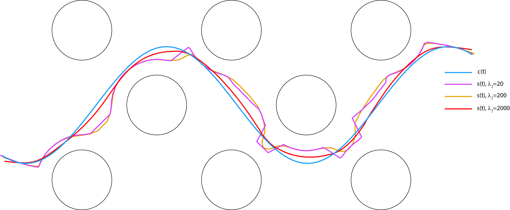
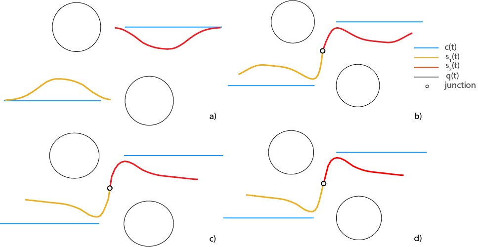

# Energy minimizing splines

The code  focuses on the design of an energy-minimizing spline that approximates a curve, fits a set of points, adapts its shape to near obstacles

The total energy $E(s(t))$ of the spline $s(t)$ is the sum of the
internal energy $E_{int}(s(t))$ and an external energy $E_{ext}(s(t))$
$$
E(s(t))=E_{int}(s(t))+E_{ext}(s(t)).\label{eq:ES}
$$

## Example 1: ems_new.m

The first example ilustrates spline interacting with multiple obstacles. The spline is attracted or repelled  by near obstacles so that it forms an approximated offset curve with the distance of δ from obstacles.

`% Parameters:

%   C        : (n1+n2)x2 data points \[xc yc]

%   Q        : nox2 obstacle boundary samples

%   n        : number of nodes of the spline

%   delta    : E4 offset

%   dist_max : E4/E5 active distance threshold

%   lambda   : [lambda1..lambda5] scalar parameterd for E1..E5

%   eps      : stopping tolerance on ||delta s||_inf

%   max_iters: maximum amount of iterations

%   k        : 1, 2, 12 order of partial derivatives`

## Example 2: ems_c0_c2_new.m

Two discrete splines  can be proposed as C0-C2 continuous at a junction point, which is beneficial for computer. The continuity constraints at the junction point of two splines will be constructed using the first and second difference formulas using samples from both splines around the junction point and yield symmetric and accurate derivative approximations.

% Join two splines s1, s2 with energies E1..E5 and enforce

%   cont = 0 : C0  only (position)

%   cont = 1 : C0 + C1 (position + 1st derivative)

%   cont = 2 : C0 + C1 + C2 (position + 1st + 2nd derivative)

% Parameters:

%   C        : (n1+n2)x2 data points [xc yc]

%   Q        : nox2 obstacle boundary samples

%   n1, n2   : number of nodes of the first/second spline

%   h        : length step

%   delta    : E4 offset

%   dist_max : E4/E5 active distance threshold

%   lambda   : [lambda1..lambda5] scalar parameterd for E1..E5

%   eps      : stopping tolerance on ||delta s||_inf

%   max_iters: maximum amount of iterations

%   method   : 1 (backslash on KKT), 2 (LDL), 3 (null-space)

%   cont     : 0,1,2 continuity mode

%   stencil  : 3, 5 stencil size`

